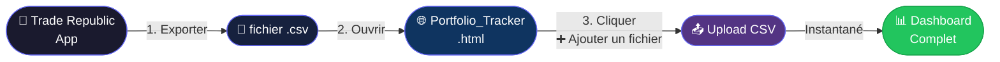

<div align="center">


# 📊 TR Portfolio Tracker

### *Votre portefeuille Trade Republic, visualisé comme jamais.*

<br/>

[](https://jeremyga2.github.io/TR-Portfolio-Tracker/)
[](./Portfolio_Tracker.html)
[](https://react.dev)
[](#)
[](#)

<br/>

> **Importez votre CSV Trade Republic → obtenez un dashboard complet en 10 secondes.**
> Aucun compte. Aucun serveur. Aucune fuite de données.

</div>

---

## 🎬 Comment ça marche



---

## 🚀 Guide pas à pas

### Étape 1 — Exporter depuis Trade Republic

Ouvrez l'application **Trade Republic** sur votre téléphone :

```
📱 Trade Republic App
 └── 👤 Profil  (icône en bas à droite)
      └── 📋 Relevés
           └── 📤 Exportation des transactions
                └── ✅ Télécharger le .csv
```

> Le fichier s'appelle quelque chose comme `Exportation de transactions.csv`

---

### Étape 2 — Ouvrir l'application

Téléchargez [`Portfolio_Tracker.html`](./Portfolio_Tracker.html) et ouvrez-le dans votre navigateur (double-clic suffit).

---

### Étape 3 — Importer votre fichier

<table>
<tr>
<td width="60px" align="center">🖱️</td>
<td>Cliquez sur le bouton <kbd>➕ Ajouter un fichier</kbd> dans l'interface</td>
</tr>
<tr>
<td align="center">📂</td>
<td>Sélectionnez votre fichier <code>.csv</code> exporté depuis Trade Republic</td>
</tr>
<tr>
<td align="center">⚡</td>
<td>Le dashboard se charge <strong>instantanément</strong> — toutes vos transactions sont analysées</td>
</tr>
</table>

---

### Étape 4 — Explorer votre portefeuille

| Onglet | Ce que vous verrez |
|--------|-------------------|
| 🏠 **Vue globale** | Valeur totale, P&L, rendement, répartition |
| 📈 **Performance** | Évolution du portefeuille dans le temps |
| 🗂️ **Par secteur** | Répartition défense / tech / crypto / ETF… |
| 💼 **Par actif** | Chaque position : prix moyen, gain/perte |
| 📅 **Historique** | Toutes vos transactions ligne par ligne |

---

## ✨ Fonctionnalités

<table>
<tr>
  <td>📥 <b>Import CSV natif</b></td>
  <td>Lit directement le format Trade Republic officiel</td>
</tr>
<tr>
  <td>🗂️ <b>Secteurs auto</b></td>
  <td>Détection par ISIN + mots-clés, 15+ secteurs reconnus</td>
</tr>
<tr>
  <td>📊 <b>Graphiques riches</b></td>
  <td>Courbes, camemberts, barres — tout interactif</td>
</tr>
<tr>
  <td>💰 <b>Prix actualisables</b></td>
  <td>Entrez les cours du jour en un clic</td>
</tr>
<tr>
  <td>👁️ <b>Mode discret</b></td>
  <td>Masquez les montants d'un clic (présentation en public)</td>
</tr>
<tr>
  <td>🔒 <b>Zéro fuite</b></td>
  <td>Tout reste dans votre navigateur — jamais envoyé ailleurs</td>
</tr>
<tr>
  <td>💾 <b>Mémoire automatique</b></td>
  <td>Vos données sont sauvegardées localement entre les sessions</td>
</tr>
</table>

---

## 🗂️ Secteurs reconnus

<div align="center">

| 🔴 Défense | 🔵 Semi-conducteurs | 🟢 Uranium & Nucléaire |
|:---:|:---:|:---:|
| Rheinmetall, Thales, Leonardo… | NVIDIA, ASML, TSMC, AMD… | Cameco, Kazatomprom… |

| 🟡 Or & Métaux précieux | 🟣 Crypto | 🔵 ETF Monde |
|:---:|:---:|:---:|
| Xetra-Gold, Physical Gold… | Bitcoin, Ethereum, 21Shares… | MSCI World, S&P 500, FTSE… |

| ⚡ Tech & Mega Caps | 🟤 Commodities | 🟠 Énergie |
|:---:|:---:|:---:|
| Apple, MSFT, Google, Meta… | Glencore, BHP, Rio Tinto… | TotalEnergies, Shell… |

| 💳 Finance | 💊 Santé & Pharma | 💎 Luxe |
|:---:|:---:|:---:|
| JPMorgan, Goldman, BNP… | Pfizer, Novartis, Sanofi… | LVMH, Hermès, Kering… |

</div>

> Actif non reconnu ? Il tombe dans *Autre* — vous pouvez forcer le secteur manuellement dans l'interface.

---

## 🛠️ Stack technique

```
📦 Portfolio_Tracker.html  (fichier unique autonome)
 ├── ⚛️  React 18          — UI (chargé via CDN, aucun build)
 ├── 📈  Recharts          — Graphiques interactifs
 ├── 🎨  Lucide React      — Icônes
 ├── 📊  SheetJS (xlsx)    — Lecture CSV / Excel
 └── 💾  localStorage      — Persistance locale des données
```

---

## 📁 Structure du projet

```
TR-Portfolio-Tracker/
├── 📄 Portfolio_Tracker.html   ← Ouvrir ça dans le navigateur
├── ⚛️  Portfolio_Tracker.jsx   ← Code source React
├── 🚫 .gitignore               ← CSV exclus (données privées)
└── 📖 README.md
```

---

<details>
<summary>🤝 <b>Contribuer au projet</b></summary>

<br/>

1. Forkez le projet
2. Créez votre branche : `git checkout -b feature/ma-fonctionnalite`
3. Commitez : `git commit -m 'feat: description'`
4. Poussez : `git push origin feature/ma-fonctionnalite`
5. Ouvrez une **Pull Request**

</details>

<details>
<summary>⚠️ <b>Note sur la confidentialité</b></summary>

<br/>

Les fichiers CSV Trade Republic contiennent vos données financières personnelles.
Ils sont explicitement exclus du dépôt via `.gitignore` — ils ne seront **jamais** committés par accident.

</details>

---

<div align="center">

**Faites croître votre richesse, pas votre stress.** 📈💡

*Questions ou suggestions → [ouvrir une issue](https://github.com/JeremyGa2/TR-Portfolio-Tracker/issues)*

<br/>


</div>
