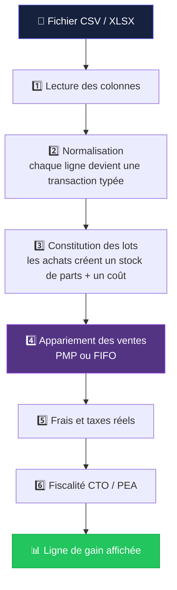

<div align="center">

# 📊 TR Portfolio Tracker

### *Votre portefeuille Trade Republic, visualisé comme jamais.*

<br/>

[](https://jeremyga2.github.io/TR-Portfolio-Tracker/)
[](./Portfolio_Tracker.html)
[](https://react.dev)
[](#)
[](#)

<br/>

> **Importez votre export Trade Republic → obtenez un dashboard complet en 10 secondes.**
> Aucun compte. Aucun serveur. Aucune fuite de données.

</div>

---

## 📑 Sommaire

| | |
|---|---|
| [🎬 Comment ça marche](#-comment-ça-marche) | Le principe en un schéma |
| [🚀 Guide pas à pas](#-guide-pas-à-pas) | De l'export TR au dashboard |
| [🧮 **Du fichier Excel à la ligne de gain**](#-du-fichier-excel-à-la-ligne-de-gain) | **Toute la logique de calcul, expliquée** |
| [✨ Fonctionnalités](#-fonctionnalités) | Ce que fait l'application |
| [🗂️ Secteurs reconnus](#️-secteurs-reconnus) | Classification automatique |
| [🛠️ Stack technique](#️-stack-technique) | Sous le capot |

---

## 🎬 Comment ça marche


```mermaid
flowchart LR
    A([🏦 Trade Republic]) -->|1. Exporter| B([📄 .csv / .xlsx])
    B -->|2. Ouvrir| C([🌐 index.html])
    C -->|3. Importer| D([⚙️ Moteur de calcul])
    D -->|Instantané| E([📊 Dashboard])

    style A fill:#1a1a2e,color:#fff,stroke:#6366f1
    style B fill:#16213e,color:#fff,stroke:#6366f1
    style C fill:#0f3460,color:#fff,stroke:#6366f1
    style D fill:#533483,color:#fff,stroke:#a855f7
    style E fill:#22c55e,color:#fff,stroke:#16a34a
```

---

## 🚀 Guide pas à pas

### Étape 1 — Exporter depuis Trade Republic

```
📱 Trade Republic App
 └── 👤 Profil  (icône en bas à droite)
      └── 📋 Relevés
           └── 📤 Exportation des transactions
                └── ✅ Télécharger le fichier
```

> [!IMPORTANT]
> **Exportez TOUT votre historique, sans filtre de date.**
> Si vos achats les plus anciens manquent, le prix de revient est faussé et vos gains
> seront surestimés. L'application détecte ce cas et vous avertit — voir
> [le garde-fou export incomplet](#-garde-fou--export-incomplet).

### Étape 2 — Ouvrir l'application

| Option | Comment |
|---|---|
| 🌐 **En ligne** | [jeremyga2.github.io/TR-Portfolio-Tracker](https://jeremyga2.github.io/TR-Portfolio-Tracker/) |
| 💻 **Ordinateur** | Téléchargez [`Portfolio_Tracker.html`](./Portfolio_Tracker.html) → double-clic |
| 📱 **iPhone** | Fichier → **Partager** → **Ouvrir dans Safari** → **Partager** → **Sur l'écran d'accueil** |

> [!TIP]
> Sur iPhone, l'aperçu de l'app Fichiers n'exécute pas le JavaScript : il **faut** passer
> par « Ouvrir dans Safari », sinon l'écran reste bloqué sur *Chargement…*

### Étape 3 — Importer

**Réglages** → <kbd>➕ Ajouter des fichiers</kbd> → sélectionnez votre export.
Les doublons sont détectés et ignorés automatiquement : vous pouvez réimporter sans crainte.

### Étape 4 — Explorer

| Onglet | Contenu |
|--------|---------|
| 📊 **Dashboard** | Cascade Brut → Frais → Impôts → Net réel, gains récents cliquables, calendrier des gains, score de santé, records |
| 👛 **Finances** | Vos gains couvrent-ils vos dépenses carte ? Surplus, autonomie, vue mois/semaine |
| 📅 **Périodes** | Comparaison période par période |
| 🎯 **Analyses** | Performance · Distribution · Meilleurs/Pires · Secteurs · Actifs · **Fiscalité** |
| 📈 **Transactions** | Historique filtrable, activité mensuelle (nombre **et** volume €), export CSV |
| ⚙️ **Réglages** | **Méthode de calcul (PMP/FIFO)**, import, secteurs, sauvegarde JSON |

---

# 🧮 Du fichier Excel à la ligne de gain

> Cette section explique **exactement** comment une ligne de votre export devient un gain
> affiché à l'écran. Chaque règle décrite ici est celle réellement appliquée par le code.


```mermaid
flowchart TD
    A[📄 Fichier CSV / XLSX] --> B[1️⃣ Lecture des colonnes]
    B --> C[2️⃣ Normalisation<br/>chaque ligne devient une transaction typée]
    C --> D[3️⃣ Constitution des lots<br/>les achats créent un stock de parts + un coût]
    D --> E[4️⃣ Appariement des ventes<br/>PMP ou FIFO]
    E --> F[5️⃣ Frais et taxes réels]
    F --> G[6️⃣ Fiscalité CTO / PEA]
    G --> H[📊 Ligne de gain affichée]

    style A fill:#16213e,color:#fff,stroke:#6366f1
    style E fill:#533483,color:#fff,stroke:#a855f7
    style H fill:#22c55e,color:#fff,stroke:#16a34a
```

---

## 1️⃣ Lecture du fichier

Le fichier est lu **entièrement dans votre navigateur** (aucun envoi réseau). L'en-tête est
détecté automatiquement dans les premières lignes, puis ces colonnes sont exploitées :

| Colonne | Rôle dans le calcul |
|---|---|
| `datetime` | Date de l'opération — ordonne les lots et calcule la durée de détention |
| `type` | Nature de l'opération (voir tableau ci-dessous) |
| `shares` | Nombre de parts — les fractions sont gérées (`55,624317`) |
| `price` | Prix unitaire d'exécution |
| `amount` | **Montant brut** de l'opération |
| `fee` | Frais de courtage |
| `tax` | Taxes prélevées à la source |
| `symbol` | ISIN — identifie l'actif et détermine son secteur |
| `account_type` | `DEFAULT` (CTO) ou `PEA` — **détermine la fiscalité** |
| `transaction_id` | Clé anti-doublon lors des réimports |

### Types d'opérations reconnus

| Catégorie | Types Trade Republic | Traitement |
|---|---|---|
| **Créent des parts** | `BUY`, `BENEFITS_SAVEBACK`, `BENEFITS_SPARE_CHANGE`, `GIFT` | Deviennent des **lots** avec un coût |
| **Consomment des parts** | `SELL`, `WARRANT_EXERCISE` | Génèrent une **plus ou moins-value** |
| **Revenus** | `DIVIDEND`, `INTEREST_PAYMENT` | Comptés en net, imposables sur CTO |
| **Trésorerie** | `CUSTOMER_INBOUND`, `CUSTOMER_OUTBOUND`, `TRANSFER_INSTANT_*` | Dépôts / retraits |
| **Dépenses** | `CARD_TRANSACTION`, `CARD_REFUND` | Alimentent l'onglet Finances |

> Les **Savebacks** et **cadeaux** créent de vraies parts : ils entrent dans le calcul comme
> des achats. Sans cela, les ventes correspondantes n'auraient aucun prix de revient.

---

## 2️⃣ Normalisation

Chaque ligne devient une transaction typée. Deux points méritent attention :

**Montants** — `amount` est le montant **brut**. Le signe est conservé séparément pour
distinguer entrées et sorties, tandis que la valeur absolue sert aux calculs.

**Ventes non réglées** — si `amount` est vide sur un ordre récent, il est reconstruit depuis
`shares × price` plutôt que d'ignorer la ligne.

---

## 3️⃣ Constitution des lots

Chaque achat crée un **lot** : une date, un nombre de parts, un coût unitaire.

```
coût d'acquisition du lot = amount + fee + tax
coût unitaire             = coût d'acquisition ÷ nombre de parts
```

> [!NOTE]
> **Les frais d'achat font partie du prix de revient.** C'est la règle fiscale française :
> ils augmentent le coût, donc réduisent la plus-value imposable. Ils ne sont **pas**
> déduits une seconde fois plus tard.

---

## 4️⃣ Appariement des ventes — PMP ou FIFO

C'est **le** paramètre qui détermine vos gains par vente. Réglable dans **Réglages**.

### 🇫🇷 PMP — Prix Moyen Pondéré *(méthode par défaut)*

```
PMP              = coût total des parts détenues ÷ nombre de parts détenues
coût de la vente = parts vendues × PMP
```

Le PMP est **recalculé à chaque achat** et reste **inchangé lors d'une vente** : vendre ne
modifie pas le prix moyen des parts restantes.

C'est la règle de l'**article 150-0 D du CGI** — et la méthode qu'affiche l'application
Trade Republic. **Utilisez-la pour retrouver les mêmes chiffres que dans l'app.**

### 🇩🇪 FIFO — Premier entré, premier sorti

Chaque vente consomme les lots les plus anciens, l'un après l'autre. C'est la méthode
allemande, conservée pour comparaison.

### 📐 Exemple chiffré

Trois achats, puis une vente de 20 parts à 20 € :

| Achat | Parts | Prix | Coût |
|---|---|---|---|
| Janvier | 10 | 10 € | 100 € |
| Février | 10 | 14 € | 140 € |
| Mars | 10 | 18 € | 180 € |
| **Total** | **30** | | **420 €** |

| Méthode | Coût retenu | Gain |
|---|---|---|
| **PMP** | 20 × (420 ÷ 30) = **280 €** | **+119 €** ← identique à Trade Republic |
| **FIFO** | lots @10 € et @14 € = **240 €** | **+159 €** |

> [!IMPORTANT]
> Le **total sur la vie du titre est identique** dans les deux méthodes.
> Seule la **répartition entre les ventes successives** change. Si vos chiffres diffèrent
> de l'app Trade Republic, vérifiez d'abord que **PMP** est bien actif.

---

## 5️⃣ Frais et taxes réels

```
produit de la vente = amount − fee − tax
plus-value nette    = produit de la vente − coût de la vente
```

Les frais imputés à une vente sont **ceux réellement présents dans votre export**, répartis
au prorata des parts concernées — jamais une estimation forfaitaire.

Chaque vente conserve sa décomposition complète, ce qui garantit l'identité :

```
gain brut  −  frais  =  gain net
```

> [!NOTE]
> **Pourquoi c'est important** : les frais de vente sont déduits **une seule fois**, au moment
> du calcul du produit. Les retrancher ensuite comme une déduction supplémentaire reviendrait
> à les compter deux fois et à sous-évaluer vos gains.

Quand un ordre ne déclare **aucun frais**, l'application distingue :

- **Plan d'épargne** — montant rond entre 10 € et 500 €, récurrent sur le même actif → sans frais
- **Ordre ponctuel** → frais estimés à 1 €

Seuls ces frais **non déclarés** viennent réduire le résultat une fois de plus, puisqu'ils ne
figurent pas déjà dans les montants du fichier.

### 🚨 Garde-fou : export incomplet

Si une vente porte sur des parts **sans achat correspondant** dans les données importées, le
prix de revient est inconnu et le gain calculé est faux.

L'application ne l'ignore plus en silence : une **bannière d'avertissement** s'affiche en tête
du Dashboard avec la liste des actifs et le nombre de parts concernées.

**C'est la cause n°1 d'écart avec l'app Trade Republic**, devant même le choix de la méthode.
La solution : réimporter un export couvrant tout l'historique du compte.

---

## 6️⃣ Fiscalité

| Compte | Traitement |
|---|---|
| **CTO** (`DEFAULT`) | **31,4 %** = PFU 12,8 % + prélèvements sociaux 17,2 % |
| **PEA** | Exonéré d'impôt sur le revenu (prélèvements sociaux dus à la sortie) |

L'assiette est calculée sur les gains **nets de frais**, après compensation des moins-values
par les plus-values. Si le solde est négatif, l'impôt est nul.

```
impôt estimé = max(0, plus-values nettes CTO + dividendes + intérêts) × 31,4 %
```

> [!WARNING]
> Estimation à visée informative. Le report des moins-values sur les années suivantes
> (10 ans en France) n'est pas modélisé. Ceci ne constitue pas un conseil fiscal.

---

## 🎯 Ce qui s'affiche au final

La cascade du Dashboard reprend exactement cet enchaînement :

```
   Gain brut          plus-values + dividendes + intérêts, avant frais
 − Frais              frais de courtage réels + non déclarés estimés
 − Impôts             31,4 % sur la part imposable CTO
 ─────────────────
 = Net réel           ce qui vous reste vraiment
```

Pour chaque vente, le détail affiche le **prix d'exécution brut** — celui que montre Trade
Republic — avec le prix net après frais entre parenthèses, pour une comparaison directe.

---

## ✨ Fonctionnalités

<table>
<tr>
  <td>🧮 <b>PMP &amp; FIFO</b></td>
  <td>Méthode de calcul au choix, PMP par défaut (fiscalité française)</td>
</tr>
<tr>
  <td>📥 <b>Import natif</b></td>
  <td>CSV et XLSX Trade Republic, anti-doublon automatique</td>
</tr>
<tr>
  <td>🚨 <b>Contrôle de fiabilité</b></td>
  <td>Alerte si l'export est incomplet et fausse les calculs</td>
</tr>
<tr>
  <td>💳 <b>Couverture des dépenses</b></td>
  <td>Vos gains couvrent-ils votre carte ? Surplus, autonomie, mois/semaine</td>
</tr>
<tr>
  <td>🧾 <b>Fiscalité CTO / PEA</b></td>
  <td>Estimation PFU 31,4 %, comptes distingués</td>
</tr>
<tr>
  <td>🗂️ <b>Secteurs auto</b></td>
  <td>Par ISIN puis mots-clés, correction manuelle possible</td>
</tr>
<tr>
  <td>👁️ <b>Mode discret</b></td>
  <td>Masquez tous les montants d'un clic</td>
</tr>
<tr>
  <td>🔒 <b>Zéro fuite</b></td>
  <td>Tout reste dans le navigateur, aucun serveur, fonctionne hors ligne</td>
</tr>
</table>

---

## 🗂️ Secteurs reconnus

<div align="center">

| 🔴 Défense | 🔵 Semi-conducteurs | 🟢 Uranium & Nucléaire |
|:---:|:---:|:---:|
| Rheinmetall, Thales, Leonardo… | NVIDIA, ASML, TSMC, AMD… | Cameco, Kazatomprom… |

| 🟡 Or & Métaux précieux | 🟣 Crypto | 🔵 ETF Monde / Émergents |
|:---:|:---:|:---:|
| Xetra-Gold, Physical Gold… | Bitcoin, Ethereum, 21Shares… | MSCI World, S&P 500, FTSE… |

| ⚡ Tech & Mega Caps | 🟤 Commodities | 🟠 Énergie |
|:---:|:---:|:---:|
| Apple, MSFT, Google, Meta… | Glencore, BHP, Rio Tinto… | TotalEnergies, Shell… |

| 💳 Finance & Banques | 💊 Santé & Pharma | 💎 Luxe |
|:---:|:---:|:---:|
| JPMorgan, Goldman, BNP… | Pfizer, Novartis, Sanofi… | LVMH, Hermès, Kering… |

| 🛒 Consommation | 🏭 Industrie | 📜 Dérivés & Warrants |
|:---:|:---:|:---:|
| Nestlé, Coca-Cola… | Siemens, Airbus… | Turbos, certificats… |

</div>

**Comment un actif est classé** : d'abord votre correction manuelle si elle existe, puis la
table d'ISIN connus, puis les mots-clés du nom, puis la classe d'actif. Sinon → *Autre*.

---

## 🛠️ Stack technique

```
📦 index.html  (fichier unique, ~1,9 Mo, 100 % autonome)
 ├── ⚛️  React 18        — interface (pré-compilé, aucun build à l'exécution)
 ├── 📈  Recharts        — graphiques interactifs
 ├── 🎨  Tailwind CSS    — styles compilés et intégrés au fichier
 ├── 📊  SheetJS (xlsx)  — lecture CSV / Excel
 └── 💾  localStorage    — persistance locale
```

> [!NOTE]
> **Aucun CDN, aucune requête réseau.** Toutes les bibliothèques sont intégrées au fichier :
> l'application fonctionne en avion, et vos données ne peuvent pas fuiter.
> Des replis sont embarqués pour les navigateurs limités (`ResizeObserver`, stockage bloqué).

## 📁 Structure du projet

```
TR-Portfolio-Tracker/
├── 📄 Portfolio_Tracker.html   ← Version téléchargeable
├── 📁 docs/index.html          ← Version servie par GitHub Pages
├── ⚛️  Portfolio_Tracker.jsx   ← Code source React
├── 🚫 .gitignore               ← Exports TR exclus (données privées)
└── 📖 README.md
```

---

<details>
<summary>❓ <b>Mes chiffres diffèrent de l'app Trade Republic</b></summary>

<br/>

Dans l'ordre :

1. **Une bannière orange s'affiche-t-elle ?** Votre export est incomplet → réimportez tout
   l'historique, sans filtre de date. C'est la cause la plus fréquente.
2. **Réglages → méthode de calcul** : **PMP** doit être actif. En FIFO, les gains *par vente*
   diffèrent forcément de ce qu'affiche Trade Republic.
3. **Comparez le prix d'exécution** affiché dans le détail de la vente avec celui de l'app.

</details>

<details>
<summary>💾 <b>Sauvegarder mes données</b></summary>

<br/>

Vos transactions vivent dans le stockage local du navigateur. Elles disparaissent si vous
videz le cache. **Réglages → Exporter (JSON)** crée une sauvegarde réimportable en un clic.

Si le navigateur bloque le stockage (fichier ouvert en aperçu, navigation privée), une
bannière rouge vous prévient : l'application reste utilisable, mais rien ne sera conservé.

</details>

<details>
<summary>🤝 <b>Contribuer</b></summary>

<br/>

1. Forkez le projet
2. Créez votre branche : `git checkout -b feature/ma-fonctionnalite`
3. Commitez : `git commit -m 'feat: description'`
4. Poussez : `git push origin feature/ma-fonctionnalite`
5. Ouvrez une **Pull Request**

Le code source est `Portfolio_Tracker.jsx` ; les fichiers HTML sont générés à partir de lui.

</details>

<details>
<summary>⚠️ <b>Confidentialité</b></summary>

<br/>

Les exports Trade Republic contiennent vos données financières personnelles. Ils sont exclus
du dépôt via `.gitignore` — ils ne seront **jamais** committés par accident.

</details>

---

<div align="center">

**Faites croître votre richesse, pas votre stress.** 📈💡

*Questions ou suggestions → [ouvrir une issue](https://github.com/JeremyGa2/TR-Portfolio-Tracker/issues)*

<br/>


<br/>

<sub>Outil personnel d'analyse. Ne constitue ni un conseil en investissement ni un conseil fiscal.</sub>

</div>
